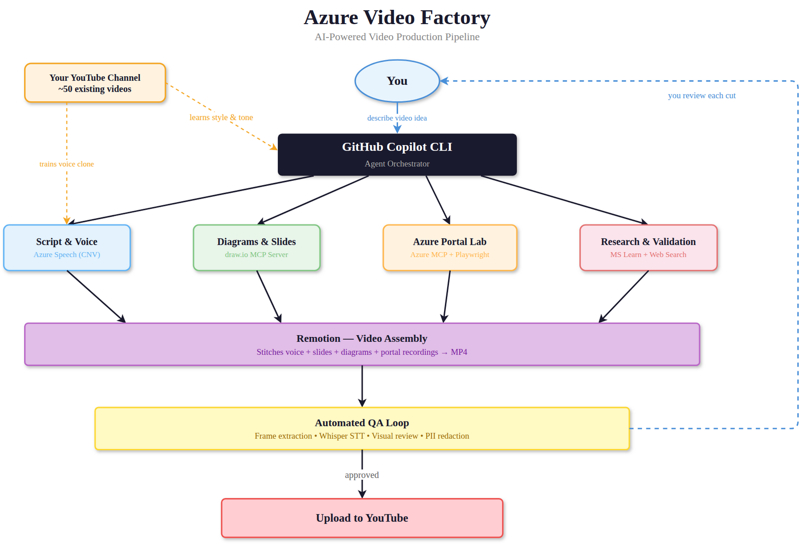

# Azure Video Factory 🎬

**How to use GitHub Copilot to build an AI-powered video production pipeline.**

> This repo documents an experiment: can you take a video idea, describe it in plain text, and have an AI pipeline handle the scripting, diagrams, voice, portal demos, video assembly, and quality checks? Turns out — mostly, yes. This write-up shares the architecture, the cost, what worked, and what didn't.

---

## The Pipeline

---

## How It Works

**You describe a video idea in plain text.** GitHub Copilot CLI — acting as an agent orchestrator — fans out parallel sub-agents:

- **Script & Voice** — writes narration in a natural speaking style, then synthesises audio using Azure Custom Neural Voice (which can be trained on your own voice)
- **Diagrams & Slides** — generates architecture diagrams programmatically via draw.io's MCP server, exports to PNG
- **Azure Portal Lab** — deploys real Azure resources, captures live portal footage via Playwright, redacts PII (subscription IDs, emails) frame-by-frame
- **Research & Validation** — cross-references every claim against Microsoft Learn docs, pricing pages, and community posts

Everything feeds into **Remotion** (a React-based video framework) which stitches voice + slides + diagrams + portal recordings into a 1080p MP4.

Then **automated QA kicks in** — frame extraction, Whisper speech-to-text verification, visual overlap detection, and PII redaction checks. You review each cut, give feedback, and the pipeline iterates. The first video produced this way went through 11 cuts before it was ready — though most of that was refining the process itself. Next time round should be significantly fewer.

---

## The Honest Take

This started as an experiment alongside an existing [Azure networking YouTube channel](https://youtube.com/c/AdamStuart1) with ~50 hand-crafted videos. It's worth being upfront about what this is and isn't.

**This is not a replacement for traditional video production.** The 20-hour approach — carefully scripted, personally recorded, thoughtfully edited — produces better content. Full stop. AI-generated video is maybe 70% of that quality today.

**But it's not all-or-nothing.** The interesting question isn't "can AI replace a YouTuber?" — it's "what can you produce that you otherwise wouldn't have time to create?" Quick explainers, supplementary content, internal training, proof-of-concept demos. Things that would never justify 20 hours of manual production but are genuinely useful.

**What works brilliantly:**
- Script generation that matches a natural speaking style — conversational, opinionated, practical
- Diagram iteration via MCP — the AI generates, you critique, it fixes
- Cross-referencing against docs catches factual errors before they ship

**What's not there yet:**
- Portal captures are fragile — headless browser auth + PII redaction needs pixel-level post-processing
- Diagrams need human review — text overlaps and box collisions are a recurring issue
- Voice is impressive but not indistinguishable from a real recording
- **The AI can't generate the insights** — it doesn't know which features customers are missing, or why a particular architecture pattern matters. Domain expertise is the human contribution

---

## The Tech Stack

| Component | What It Does |
|-----------|-------------|
| [GitHub Copilot CLI](https://docs.github.com/en/copilot) | Agent orchestration — the central brain |
| [Azure Custom Neural Voice](https://learn.microsoft.com/en-us/azure/ai-services/speech-service/custom-neural-voice) | Text-to-speech, optionally trained on your voice |
| [Remotion](https://remotion.dev) | React components → 1080p video at 30fps |
| [draw.io MCP Server](https://github.com/jgraph/drawio-mcp) | Programmatic diagram generation & export |
| [GitHub MCP Server](https://github.com/github/github-mcp-server) | Version control, issue tracking, project management |
| [Azure MCP Server](https://github.com/Azure/azure-mcp-server) | Resource deployment, portal automation |
| [Playwright](https://playwright.dev) | Headless browser portal capture |
| ffmpeg + PIL | Post-processing, frame extraction, PII redaction |

The glue is **MCP (Model Context Protocol)** — it gives Copilot direct tool access to these services. Without it, the AI suggests commands. With it, the AI *does the work*.

---

## Want to Try This?

1. **Start with Copilot CLI** — it's the orchestration layer. [Get started](https://docs.github.com/en/copilot)
2. **Add MCP servers** — draw.io and GitHub are the most immediately useful
3. **You don't need a custom voice** — Azure's stock voices are excellent now, especially the DragonHD voices (e.g. `en-US-Andrew:DragonHDLatestNeural`) which sound remarkably natural
4. **Use Remotion** — React components as video slides is a natural mental model
5. **Iterate** — the magic is in the feedback loop: generate → review → fix → re-generate

The barrier to entry is lower than you think. Give it a go.

---

*Built with GitHub Copilot CLI · Azure Custom Neural Voice · Remotion · draw.io MCP*
